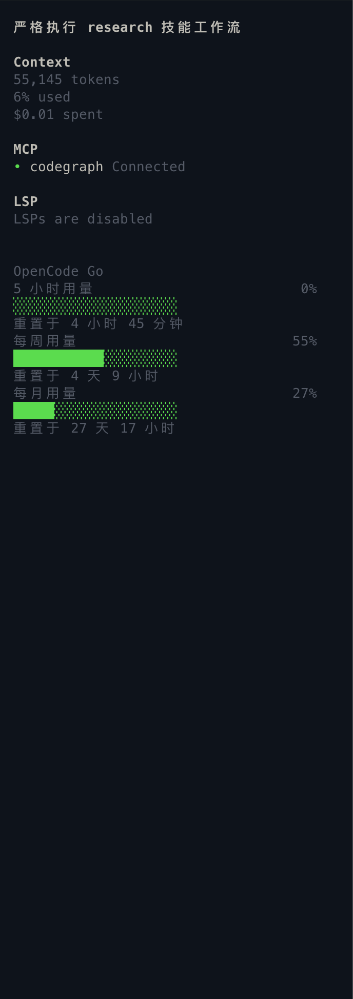

# opencode-go-usage

opencode TUI 插件：在侧栏展示 OpenCode Go 套餐的 5 小时 / 每周 / 每月额度。



> 上图是 `detailed` 样式。默认的 `compact` 样式是一行一档，见下面的[配置](#配置)。

每档展示标签、实心进度条、百分比、重置倒计时。有 `compact`（一行一档，默认）与 `detailed`（三行一档）两种样式，见[配置](#配置)。

进度条是带背景色的实心色块（不是 `█` 字符），颜色全部取自主题的语义 token，所以深色浅色主题都自动跟随。渲染在 `sidebar_content` slot；节标题的颜色与粗体跟宿主的 `Context` / `MCP` / `LSP` 一致。

## 文档

| 文档 | 读它来 |
|---|---|
| [安装指南](docs/安装指南_20260916.md) | 从零到看见额度，三步 |
| [排障指南](docs/排障指南_20260916.md) | 装了看不到、位置不对、数字不更新 |
| [配置与行为契约](docs/配置与行为契约_20260916.md) | 每个常量、格式、失败态的准确定义 |
| [手工验证清单](docs/OpenCodeGo额度侧栏_手工验证清单_20260916.md) | 7 项需人工判断的验收 |
| [设计规格](docs/superpowers/specs/OpenCodeGo额度侧栏_20260916.md) | 为什么这样设计，含调研结论与"明确不做"清单 |

## 快速安装

需要 opencode **≥ 1.18.30** 和 [bun](https://bun.sh)。

```bash
export REPO="$HOME/workspace/opencode-go-usage"
cd "$REPO" && bun install
```

注册到 `~/.config/opencode/tui.json`（**不是** `opencode.json`，后者只加载 server 端插件）：

```json
{
  "$schema": "https://opencode.ai/tui.json",
  "plugin": ["/绝对路径/opencode-go-usage/tui.tsx"]
}
```

重启 opencode 生效。`plugin` 里必须是绝对路径。

已有 `tui.json` 时用[安装指南](docs/安装指南_20260916.md#step-2-注册插件)里的幂等合并命令，它会保留你原有的配置和其他插件。

**没看到额度小节？** 这是常见情况——插件有四条静默失败路径，全都表现成"整节不显示"。[排障指南](docs/排障指南_20260916.md#先跑这一条数据层诊断)里有一条命令能直接定位。

## 密钥

按顺序解析，插件不存任何副本：

1. 环境变量 `OPENCODE_GO_API_KEY`
2. opencode 自己的 `auth.json` 里的 `opencode-go.key`

所以 `opencode auth login` 登录过 OpenCode Go 就是零配置。

`auth.json` 在 opencode 的 **data** 目录（macOS/Linux 是 `$XDG_DATA_HOME/opencode`，默认 `~/.local/share/opencode`），**不是** `api.state.path.state` 指向的 state 目录（`~/.local/state/opencode`）。插件按候选列表顺序找，data 目录优先。完整规则见[配置与行为契约 §3](docs/配置与行为契约_20260916.md#3-密钥解析)。

## 刷新

- 助手每次回复结束（`session.idle`）后刷新，最小间隔 20 秒；
- 另有 5 分钟兜底定时刷新；
- 倒计时文本每 60 秒本地重算，不发请求；
- 网络错误或 5xx 时保留上次数值，标题显示为 `OpenCode Go !`。

## 配置

把 `~/.config/opencode/tui.json` 里的插件项从字符串改成 `[路径, 配置]` 两元数组：

```jsonc
{
  "$schema": "https://opencode.ai/tui.json",
  "plugin": [
    ["/绝对路径/opencode-go-usage/tui.tsx", { "style": "detailed", "order": 600 }]
  ]
}
```

| 字段 | 取值 | 默认 | 说明 |
|---|---|---|---|
| `style` | `"compact"` \| `"detailed"` | `"compact"` | 展示样式，见下 |
| `order` | 数字 | `350` | 侧栏位置。`350` 在 LSP 与 Todo 之间；`600` 沉到最底。完整 order 表见[配置与行为契约 §5](docs/配置与行为契约_20260916.md#5-侧栏排序契约) |

改完**重启 opencode**（`tui.json` 只在启动时读）。值写错会静默回退到默认，不会让插件加载失败。

### 两种样式

**`compact`（默认）** —— 一行一档，占 3 行：

```
OpenCode Go
滚动  █░░░░░░░░░░░░░   8%   4h58m
本周  ████████░░░░░░  55%   4d10h
本月  ████░░░░░░░░░░  27%  27d16h
```

**`detailed`** —— 三行一档，占 9 行；条子更长（20 格），标签与倒计时用完整措辞：

```
OpenCode Go
5 小时用量           8%
██░░░░░░░░░░░░░░░░░░
重置于 4 小时 58 分钟
每周用量            55%
███████████░░░░░░░░░
重置于 4 天 10 小时
每月用量            27%
█████░░░░░░░░░░░░░░░
重置于 27 天 16 小时
```

两种样式的进度条都是带背景色的实心色块，配色也一致（见[配置与行为契约 §6](docs/配置与行为契约_20260916.md#6-渲染规格)）；区别只在信息密度与占用行数。

## 已知限制

上游 `/zen/go/v1/usage` 只返回**整数**百分比与 `resetsAt`，不返回 token 数或金额。opencode 官方 web dashboard 显示的一位小数（如 `8.1%`）来自另一条更精细的通路，本插件取不到，因此只显示 `8%`。

## 测试

```bash
bun test
```

41 个用例，只覆盖 `usage.ts` 的纯函数（密钥解析、取数三态、刷新状态机、格式化）。`tui.tsx` 的渲染没有单测，靠 `bunx tsc --noEmit` 加[手工验证清单](docs/OpenCodeGo额度侧栏_手工验证清单_20260916.md)。

## 卸载

```bash
rm ~/.config/opencode/tui.json
```

重启 opencode。你原有的 `opencode.json` / `opencode.jsonc` 从未被本插件改动。
