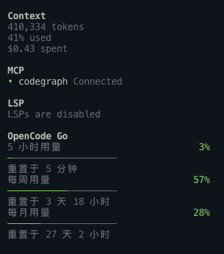
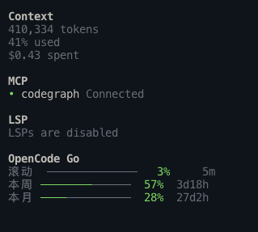
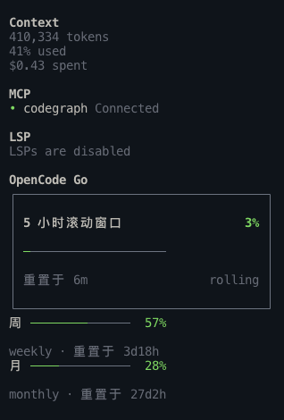

# How to 切换 OpenCode Go 额度侧栏样式

本指南说明如何在 OpenCode TUI 中选择额度侧栏的三种布局，并把实际运行截图与配置方式放在一起。你会看到 A、B、C 三个样式都保留，配置适合设置默认值，slash command 适合临时切换当前会话。

## 前置条件

- 已安装并注册 opencode-go-usage TUI 插件。
- OpenCode 版本 ≥ 1.18.30。
- 已重启 OpenCode。tui.json 只在进程启动时读取。

## 三种样式

| 配置值 | 方向 | 适合场景 |
|---|---|---|
| compact | B · 一眼扫读 | 想用最少高度快速看三档百分比 |
| detailed | A · 终端原生 | 想完整看到每档标签、进度和重置语义 |
| ledger | C · 额度账本 | 最关心 5 小时窗口，同时保留周/月背景 |

其中 rolling 始终表示 5 小时滚动窗口，不是侧栏滚动位置。

### A · detailed



每个窗口占三行：标签与百分比、细线 meter、重置倒计时。它最适合需要完整语义的阅读方式。

### B · compact



三个窗口各占一行，滚动窗口明确标为 5 小时，适合在窄侧栏里扫读。

### C · ledger



5 小时窗口使用主指标块，周/月压缩为次级行。它比 detailed 节省高度，又比 compact 更突出当前窗口。

> 截图中的百分比、token 和倒计时是截图生成时的真实快照，不是文档里的固定示例值。

## 持久设置默认样式

编辑 OpenCode 的 TUI 配置文件：

```jsonc
{
  "$schema": "https://opencode.ai/tui.json",
  "plugin": [
    ["/绝对路径/opencode-go-usage/tui.tsx", {
      "style": "ledger",
      "order": 600
    }]
  ]
}
```

把 style 改成 compact、detailed 或 ledger，然后完整退出并重新启动 OpenCode。

如果当前 plugin 还是字符串形式：

```jsonc
"plugin": [
  ["/绝对路径/opencode-go-usage/tui.tsx", { "style": "compact" }]
]
```

order 不是样式开关。350 会把小节放在 LSP 与 Todo 之间，600 会把它放到侧栏更靠下的位置。

## 临时切换当前会话

在 OpenCode 的命令输入框或 command palette 中使用：

```text
/go-usage-compact
/go-usage-detailed
/go-usage-ledger
```

命令只改变当前 TUI 会话的布局，不重新请求额度、不改变密钥、不改变刷新间隔。重启后仍以 tui.json 的 style 为准。

这些命令使用 OpenCode 新版 TUI 的 keymap 注册入口；如果宿主没有可用的 keymap 能力，插件仍保留侧栏和配置切换。

## 浅色与深色主题

三种样式都从 OpenCode 当前主题读取颜色：

- 正常用量：success。
- 70% 及以上：warning。
- 90% 及以上或 rate-limited：error。
- 未用轨道：border；如果和背景对比不足，回退到 textMuted。
- ledger 主块：backgroundPanel 与 borderActive。

切换主题后不需要改插件配置。若轨道仍然看不见，请先确认主题本身的 textMuted 与 background 是否有足够对比。

## 验证是否生效

1. 重启 OpenCode，确认侧栏出现 OpenCode Go。
2. 确认 rolling 标签对应 5 小时窗口。
3. 依次检查三种 style 的布局是否与上面的截图相符。
4. 在浅色和深色主题各检查一次文字、细线 meter、百分比和 ledger 主块。
5. 打开 command palette，搜索 OpenCode Go，确认三个样式命令出现。

数据诊断和密钥问题请看[排障指南](排障指南_20260916.md)；字段、刷新和主题 token 的完整契约请看[配置与行为契约](配置与行为契约_20260916.md)。

## 相关文档

- [安装指南](安装指南_20260916.md)
- [配置与行为契约](配置与行为契约_20260916.md)
- [手工验证清单](OpenCodeGo额度侧栏_手工验证清单_20260916.md)
